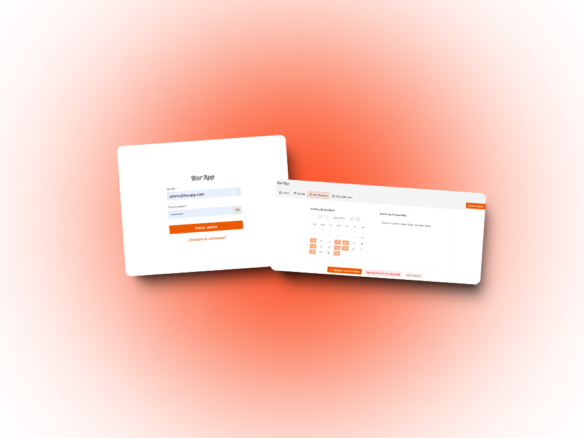
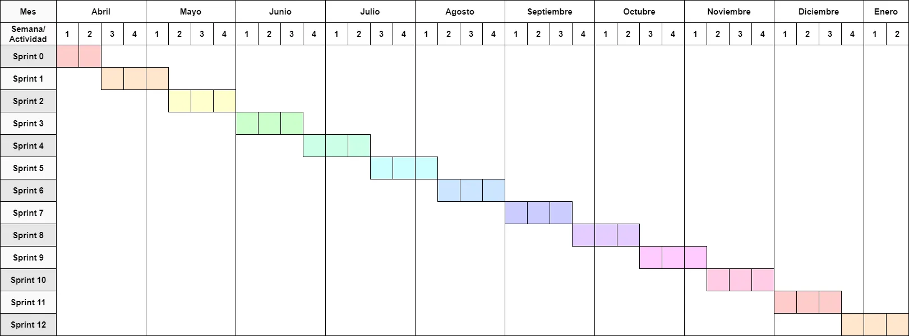

 
    

  

[Reportar error](https://github.com/BarApp-Chort-Quarin-Reynoso/BarApp-Web/issues) · [Ver plan de proyecto](https://docs.google.com/document/d/1dDYaoWykSRaM1nkCH1_gco9MEoXOnQTWLxpbtQdcf0A/edit?usp=sharing)

 

# BarApp - Prototipo de página web

> PROYECTO FINAL DE CARRERA - INGENIERÍA EN SISTEMAS DE INFORMACIÓN

Este repositorio contiene el código fuente del prototipo de la página web de **BarApp**, una aplicación para la gestión de reservas en bares y restaurantes.

## 🎯 Objetivo general

Implementar un prototipo funcional de una plataforma única de gestión de reservas para bares de la ciudad de Santa Fe que agregue valor tanto a los locales comerciales como a sus clientes.

## 📱 Descripción

El prototipo de la página web de **BarApp** es una aplicación web desarrollada en **Vaadin** que permite a los usuarios realizar reservas en bares y restaurantes. La página permite a los dueños de los establecimientos gestionar las reservas y la disponibilidad de mesas. También les permite visualizar las opiniones de los clientes y responder a las mismas.

## ⚖️ Estimación de duración del proyecto

- Duración de los _sprints_: 3 semanas
- Tiempo dedicado: 4,8 PE/semana (1 PE = 5 horas)
- Velocidad del sprint: 14,4 PE/sprint
- Duración estimada del proyecto: 38 semanas
- Cantidad de _sprints_: 13

## ⏳ Cronograma del proyecto

  

## 🛠️ Ambiente de desarrollo, tecnologías y plataformas

## 👨🏻‍💻 Alumnos

- **Chort**, Julio Alberto
- **Quarin**, Federico
- **Reynoso**, Valentín

## 📚 Directora

- **Ing. Blas**, María Julia
